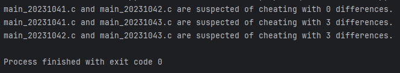
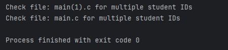

## Check psut students' c file differences

### How to use:
1. Place all the students' main.c files inside the directory with name `Files`
2. Run `rename.py`, this will rename the main.c files with the student ID. **If a file main.c contains more
than one student id, you will be prompted with an error with the file name**
3. Run `find_diff.py`, this will output the file names with difference count less than `THRESHOLD`, which is currently
set to `10` differences. 
   - _i.e. if difference count less than `10` differences, suspect of cheating_

#### Sample output:

